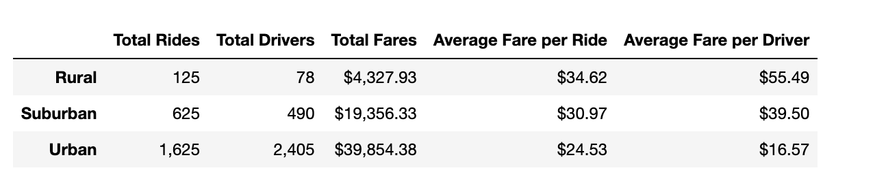
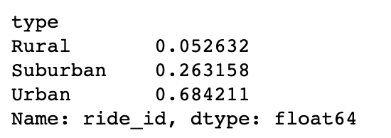
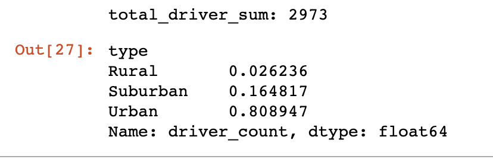
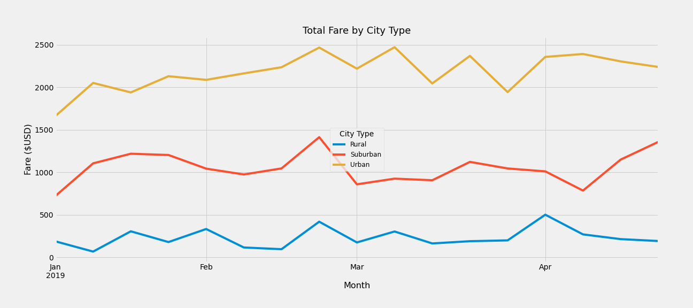

# PyBer Analysis

## Overview
The goal of this analysis is to discover key performance indicators for a ride sharing application to help improve underserved city "type" to gain access to the service as well as making it affordable. This analysis groups rides compeleted into city characteristics by "type". The 3 possible city types are as followed:

- Rural
- Suburban
- Urban  

## Results
The following is a snipet of statistcal data by neighborhood "type"

**Findings:**
1. Urban cities have the highest demand. 68% of the total rides completed were in urban areas
    - 
2. Urban cities have the highest count of drivers. 81% of drivers are in urban areas
    - 
3. Rual cities have the highest average fare per ride and driver. It also have to loweset total rides completed and number of drivers. The data shows the high fare price is correlated with the lack of drivers and low demand. 
 
## Summary 
Below are recommendations to help improved the affordability of ride sharing in rual and surburban areas:

1. Offer a tier reward bonus program for drivers in rual and surburban areas to help encourage drivers to offer their services in those areas to compensate for the inital low demand. Rual areas should have a higer bonus then surburban areas. 

2. The average fare by driver indidcates that the distance for each ride is longer in the rual and surburban areas. Drivers tend not want to drive far distance and not have a passaenger on their way back to there destination. The company potentially can attract new riders by offering free ride promos and pair the free rides with drivers who need to make return trips to the area they started. The company can paid for these fares from their marketing budget. 

